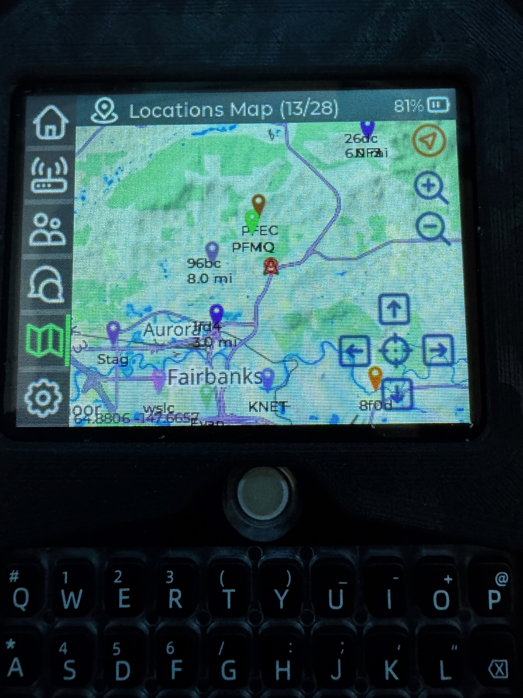

# T-Deck Offline Maps Guide
<p align="center">
  
  
  
  
  
  
</p>

<p align="center">
  Simple guide to get offline maps working on the LilyGO T-Deck using Meshtastic MUI and an SD card.<br>
  Field-tested in Alaska and the Lower 48.
</p>

> New? Start here -> [Quick Start](#-quick-start)

---

## 📸 Example

<p align="center">
  
</p>

---

## 🚀 Quick Start

1. Clone this repository

```bash
git clone https://github.com/kl5pfak/tdeck-offline-maps-guide ~/tdeck-maps-guide
cd ~/tdeck-maps-guide
```

2. Clone the tile generator and install dependencies

```bash
git clone https://github.com/JustDr00py/tdeck-maps ~/tdeck-maps
pip3 install requests Pillow
```

3. Configure map sources (optional)

  You only need a Thunderforest API key if you use Thunderforest-backed sources (for example `cycle`, and any custom Thunderforest URLs you add).
  Default sources like `terrain`, `osm`, and `satellite` work without a Thunderforest key.

   Example (`cycle` with API key):

```python
def get_tile_url(self, x, y, zoom, source="osm"):
  thunderforest_key = "YOUR_THUNDERFOREST_API_KEY"
  sources = {
    "osm": f"https://tile.openstreetmap.org/{zoom}/{x}/{y}.png",
    "satellite": f"https://server.arcgisonline.com/ArcGIS/rest/services/World_Imagery/MapServer/tile/{zoom}/{y}/{x}",
    "terrain": f"https://tile.opentopomap.org/{zoom}/{x}/{y}.png",
    "cycle": f"https://tile.thunderforest.com/cycle/{zoom}/{x}/{y}.png?apikey={thunderforest_key}",
  }
  return sources.get(source, sources["osm"])
```

4. Build maps

**Quick & Easy (pre-configured regions):**
```bash
./build-anchorage.sh              # Downloads Anchorage area (zoom 4-10)
./build-ak.sh                     # Downloads Fairbanks area (zoom 4-10)
./build-charleston.sh             # Downloads Charleston area (zoom 4-10)
```

**Custom city (you specify location, zoom, source):**
```bash
# Format: build-core.sh "City, State" min_zoom max_zoom source [card_label]
./build-core.sh "Denver, Colorado" 4 10 terrain
./build-core.sh "Seattle, Washington" 4 12 satellite TDECK-AK
```

**Overlays (layered maps with Thunderforest source):**
```bash
# Format: build-overlay.sh "City, State" overlay_source [base_zoom_start] [base_zoom_end] [overlay_zoom_end] [base_source] [card_label]
./build-overlay.sh "Anchorage, Alaska" cycle
./build-overlay.sh "Fairbanks, Alaska" cycle 6 7 13 terrain TDECK-AK
```

**Vector overlays from potamap (GeoJSON for parks, peaks, etc.):**
```bash
scripts/list-potamap-region-layers.sh US-AK --titles-only
scripts/fetch-potamap-overlays.sh US-AK 'Parks|Counties'
scripts/copy-overlay-bundle.sh US-AK TDECK-AK
```

5. Load maps

Insert SD card -> reboot -> open Maps in MUI

## ⚠️ Important

- Maps must be in /maps/osm/
- You must include zoom levels 4, 5, and 6
- Public OSM tiles may return 403 errors
- If the map is blank, zoom out first

## 🏔 Alaska Strategy

Do not build full Alaska at high zoom on a free tile API.

Best setup:
- Low zoom (4–7) → statewide Alaska base
- High zoom (6–12) → Fairbanks / local detail

For full strategy details, see the wiki page: [Alaska Strategy](https://github.com/kl5pfak/tdeck-offline-maps-guide/wiki/Alaska-Strategy)

## 📚 Full Documentation

👉 [View the Wiki](https://github.com/kl5pfak/tdeck-offline-maps-guide/wiki)

- [Setup & Installation](https://github.com/kl5pfak/tdeck-offline-maps-guide/wiki/Setup-Guide)
- [Build Scripts](https://github.com/kl5pfak/tdeck-offline-maps-guide/wiki/Build-Guide)
- [Overlay Maps (POTA / GeoJSON)](https://github.com/kl5pfak/tdeck-offline-maps-guide/wiki/Overlay-Maps-(POTA---GeoJSON))
- [Map Sources](https://github.com/kl5pfak/tdeck-offline-maps-guide/wiki/Map-Sources)
- [Troubleshooting](https://github.com/kl5pfak/tdeck-offline-maps-guide/wiki/Troubleshooting)

---

## 📋 Changelog

See [CHANGELOG.md](CHANGELOG.md) for full version history.
